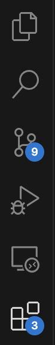
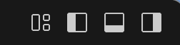

# PynCraft

A Python API to Minecraft that works with the
[FruitJuice](https://github.com/jdeast/FruitJuice) 
PaperMC plugin to enable a python and/or scratch programming interface.  It can 
also use the `RCON` protocol to issue Minecraft commands from python.

## Server Setup

See [FruitJuice/server_setup/README_ssetup.md](https://github.com/jdeast/FruitJuice/blob/master/server_setup/README_setup.md) 
for instructions for setting up a python/scratch server that works on java 
or bedrock using Docker.  It runs on Minecraft version 1.20.6, but can
be accessed from newer clients (1.21 as of May 2025) using the 
[ViaVersion](https://viaversion.com/index.html) plugin.  In addition to 
`FruitJuice`, the server supports the `RCON` (remote console) protocol.

Don't worry-- it's pretty easy.  You can skip this step if someone has 
already configured a FruitJuice server for you.  In that case, you just 
need to get its IP address or URL.

## Development Environment

You will need to set up some software for coding.

### Python

You will need a recent (3.9 or higher) version of python running on your
computer.  One easy way to install it is from this link:

https://www.python.org/downloads/ 

### Visual Studio Code (VSCode)

VSCode is a free Integrated Development Environment (IDE) application that
may be used for developing code.  It has a lot of nice features, like 
an editor that colors your python code and checks for errors, a debugger, 
an integrated terminal, a Docker plugin and tools for connecting to Docker 
containers so you can write code for them while they're running.  It even 
has AI built in to help you write code!  It's free-- give it a try!

Download VSCode for your operating system 
[from here](https://code.visualstudio.com/download).  
Launch VSCode, then "Open Directory" and  pick (or create) `minecraft/code`
in your home directory. You will then need to install extensions to make 
it work with python and Jupyter notebooks.


On the left edge, you will see a column of icons.  From the top, they are:
<div style="display: flex; flex-direction: row; align-items: flex-start;">
  <div style="flex: 0 0 35px; margin-left: 0px;">
    
  </div>
  <div style="flex: 1; margin-left: 0px;">
    <ul>
      <li><strong>File Explorer</strong>: you can use this to access all the files in your project.</li>
      <li><strong>File Search</strong>: search for text in any of your project's files</li>
      <li><strong>Version Control</strong>: you can use this to work with <code>git</code></li>
      <li><strong>Debugger</strong>: set breakpoints in your code, so you can see what happens when it runs</li>
      <li><strong>Remote Explorer</strong>: connect to servers or Docker containers</li>
      <li><strong>Extensions</strong>: use this to add functionality to VSCode</li>
      <li>(other extensions below that you've added)</li>
    </ul>
  </div>
</div>

Click on the File Extensions icon (four squares with the upper right one offset),
then search for "python".  Choose the "Python" package from Microsoft, and
it will install the tools you need.  

Then search for "Jupyter" and select the "Jupyter" extension from 
Microsoft.  This will install support for Jupyter notebooks, a popular way of 
interacting with python where you can combine nicely-formatted documentation 
with "cells" where you run code.

Then click on the **File Explorer** icon at the top.  The panel next to these
icons will show you the files in your project.  If you click on one of them,
it will open in the editor to the right.  This is where you will work on your
code.  You can have multiple editor windows open at once; they will appear
as different tabs.  You can also split the editor panels horizontally or 
vertically so you can see multiple files, or multiple parts of the same file
at once.

At the top right of the VSCode screen, you will see these icons:



The one with the horizontal split that is highlighted on the bottom (second
from right) will toggle the a panel at the bottom.  This is how you can 
access a terminal.  By default, it will show whatever your default Terminal
type is-- `bash`, `zsh`, `Powershell`, etc.  You can use this to interact
with the file system, or to run operating system commands.

### Git

This is used to download open source code from the GitHub and other 
repositories. 

## Getting Started

To get started, install `pyncraft` into your python environment:
```
pip install pyncraft
```
In your python script or Jupyter notebook, import `pyncraft`, then create 
a `Minecraft` instance:
```
from pyncraft import Minecraft

# replace 'localhost' with the server IP address if the server 
# is running on a different computer 
address = 'localhost'

# put your player name in the quotes
player_name = "your-minecraft-player-name"

# this is the default unless you changed it
juice_port = 4711

# mc will be your connection to Minecraft
mc = Minecraft.create(address=address, port=juice_port,  playerName=player_name)
```

You can use help to see what commands are available:
```
help(mc)
```

## History

- The Minecraft: Pi edition Python library was originally created by Mojang 
and released with Minecraft: Pi edition. Initial supported was provided for 
Python 2 only, but during a sprint at PyconUK 2014 it was migrated to Python 3
and [py3minepi](https://github.com/py3minepi/py3minepi) was created.

- The [RaspberryJam](https://github.com/arpruss/raspberryjammod) mod was
developed by arpruss for Minecraft 1.8 on the Raspberry Pi.

-  The [RaspberryJuice](https://github.com/zhuowei/RaspberryJuice) plugin 
supported Minecraft Java Edition.  Martin O'Hanlon developed it and maintained 
it through 2019.

- After that the [MinecraftDawn fork](https://github.com/zhuowei/RaspberryJuice).
was maintained for a few years, but has not been very active.

- The present repo is a fork of that.  The `FruitJuice` plugin was originally 
developed for Bukkit/Spiget, which are no longer maintained.  This fork uses 
PaperMC instead.  It also supports Bedrock Edition.

- Martin O'Hanlon wrote the python package 
[mcpi](https://github.com/martinohanlon/mcpi), as well as the book 
"Adventures in Minecraft" (with David Whale, 2014).  This is the predecessor of
`PynCraft`. 
